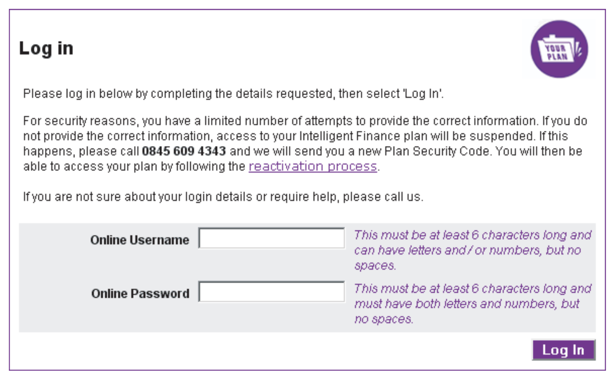
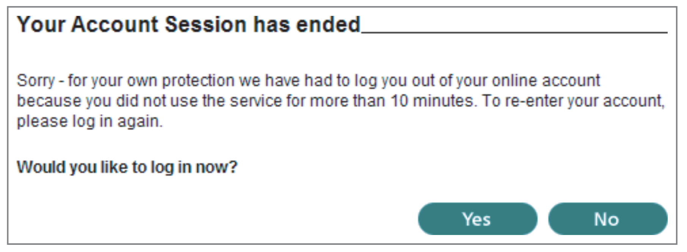
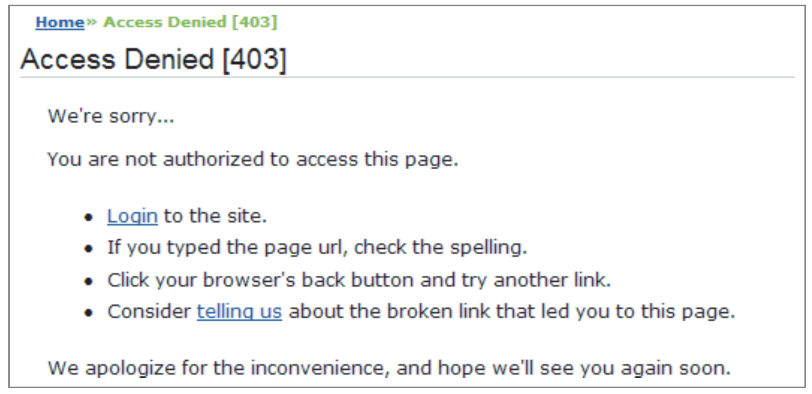
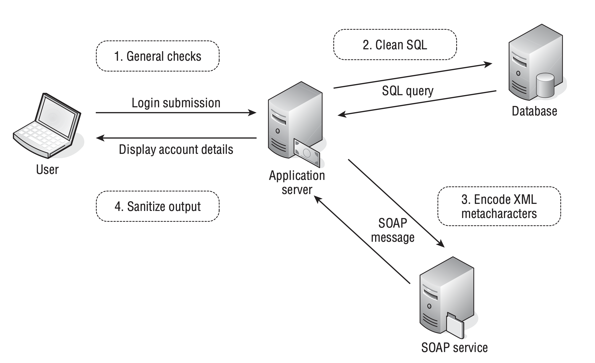

# Chapter-2 Core Defense Mechanisms

Web applications face a fundamental security problem as all user input is untrusted, and various defense mechanisms are used to prevent attacks. These defense mechanisms include  
* handling user access, 
* handling user input, 
* handling attackers, and 
* administering the application. 

Since these mechanisms make up the majority of an application's attack surface, it's important to thoroughly understand them to effectively attack applications. It's important to identify weak points in these mechanisms to find vulnerabilities in web applications.

# 1.0 Handling User Access

Web applications need to control users' access to data and functionality, which can be achieved through 
* authentication, 
* session management, and 
* access control mechanisms. 

Different categories of users require different levels of access, and a defect in any one of these mechanisms can compromise the security of the entire application. Therefore, all three mechanisms must be strong to ensure robust security.

## 1.1 Authentication

* Authenticating a user is important to establish their identity and trust level in an application.
* Majority of web applications use username-password based authentication.
* Additional credentials and multistage login process are used in security-critical applications.
* Other authentication models include client certificates, smartcards, or challenge-response tokens.
* Supporting functionality of authentication mechanisms includes self-registration, account recovery, and password change facility.
* Authentication mechanisms often have defects in design and implementation, which can be exploited by attackers.
* Attacks on authentication-related functions can lead to unauthorized access to sensitive data and functionality.

* Login Functionality:
   

## 1.2 Session Management

* To enforce access control, web applications need to manage authenticated user sessions.
* Sessions are a set of data structures held on the server that track the state of the user's interaction with the application, and they are identified by tokens.
* Tokens are unique strings that the application maps to the session and are transmitted via HTTP cookies, hidden form fields, or URL query strings.
* Session tokens are highly dependent on security, and attacks against them aim to compromise tokens issued to other users.
* Defects in how tokens are generated or handled can enable attackers to guess or capture other users' tokens.
* Some applications don't use session tokens and instead use HTTP's built-in authentication mechanism or storing state information on the client side.
* Session Timeout:
   

## 1.3 Access Control

* The final step in handling user access is to make correct decisions about each individual request.
* The application needs to decide whether the user is authorized to perform the action or access the data they request.
* Access control requires fine-grained logic for different areas of the application and different types of functionality.
* The mechanism is a frequent source of security vulnerabilities that enable unauthorized access.
* Developers often make flawed assumptions and oversights in access control checks.
* Access control testing is a worthwhile investment as access control flaws are prevalent.
* Application enforcing access control:
   

# 2.0 Handling User Input 

The fundamental security problem is that all user input is untrusted, and attacks against web applications often involve submitting unexpected input. Input-based vulnerabilities can arise in any part of an application and with any type of technology. Input validation is frequently cited as the necessary defense, but no single protective mechanism can be used everywhere, and defending against malicious input is not always simple.
  
## 2.1 Approaches to Input Handling  

Approaches to Handling Malicious Input includes:

1. **Reject Known Bad**: Uses a blacklist of known attack patterns, but can be easily bypassed.
2. **Accept Known Good**: Employs a whitelist of safe input, but may not be suitable for all situations.
3. **Sanitization**: Cleans potentially unsafe data before processing.
4. **Safe Data Handling**: Ensures inherently safe processing of user input.
5. **Semantic Checks**: Validates user input to prevent unauthorized access.

# 3.0 Boundary Validation  

* The security problem with web applications is that data received from users is untrusted.
* Input validation checks on the client side do not provide assurance about the data that reaches the server.
* User data at the point of reception represents a trust boundary, and the application needs to defend itself against malicious input.
* The simple picture of input validation as a frontier between the Internet and the server-side application is inadequate due to the wide range of functionality and different types of processing involved.
* A more effective model is boundary validation, where each component or functional unit of the server-side application treats its inputs as coming from a potentially malicious source.
* Data validation is performed at each trust boundary, in addition to the external frontier between the client and server.
* Validation checks are implemented at different stages of processing and are unlikely to conflict with one another.
* Below Image illustrates a typical situation where boundary validation is the most effective approach to defending against malicious input.
   
* Suitable validation is performed at each step of the user login process to defend against specific types of crafted input.
* Similar defenses would need to be implemented at relevant trust boundaries for other application components that involve passing data.