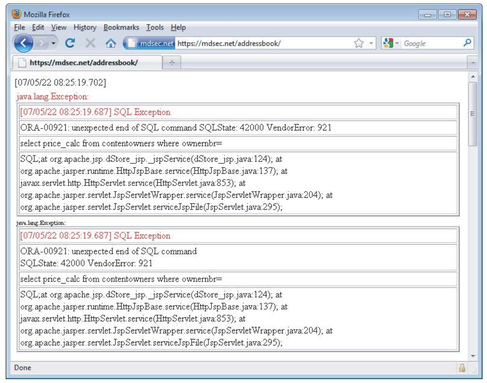
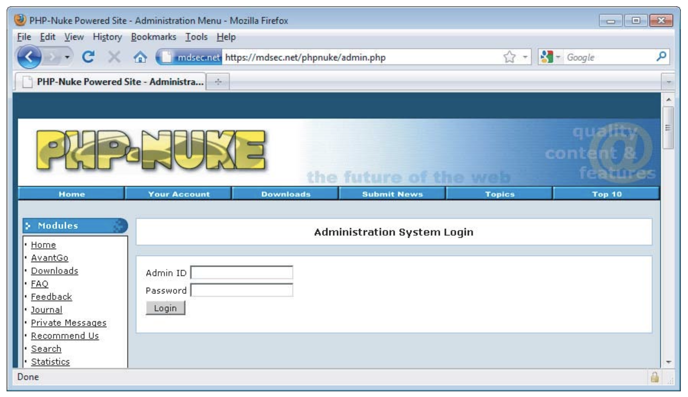

# Chapter-2 Core Defense Mechanisms

Web applications face a fundamental security problem as all user input is untrusted, and various defense mechanisms are used to prevent attacks. These defense mechanisms include  
* handling user access, 
* handling user input, 
* handling attackers, and 
* administering the application. 

Since these mechanisms make up the majority of an application's attack surface, it's important to thoroughly understand them to effectively attack applications. It's important to identify weak points in these mechanisms to find vulnerabilities in web applications.

# 1.0 Handling User Access

Web applications need to control users' access to data and functionality, which can be achieved through 
* authentication, 
* session management, and 
* access control mechanisms. 

Different categories of users require different levels of access, and a defect in any one of these mechanisms can compromise the security of the entire application. Therefore, all three mechanisms must be strong to ensure robust security.

## 1.1 Authentication

* Authenticating a user is important to establish their identity and trust level in an application.
* Majority of web applications use username-password based authentication.
* Additional credentials and multistage login process are used in security-critical applications.
* Other authentication models include client certificates, smartcards, or challenge-response tokens.
* Supporting functionality of authentication mechanisms includes self-registration, account recovery, and password change facility.
* Authentication mechanisms often have defects in design and implementation, which can be exploited by attackers.
* Attacks on authentication-related functions can lead to unauthorized access to sensitive data and functionality.

* Login Functionality:
   

## 1.2 Session Management

* To enforce access control, web applications need to manage authenticated user sessions.
* Sessions are a set of data structures held on the server that track the state of the user's interaction with the application, and they are identified by tokens.
* Tokens are unique strings that the application maps to the session and are transmitted via HTTP cookies, hidden form fields, or URL query strings.
* Session tokens are highly dependent on security, and attacks against them aim to compromise tokens issued to other users.
* Defects in how tokens are generated or handled can enable attackers to guess or capture other users' tokens.
* Some applications don't use session tokens and instead use HTTP's built-in authentication mechanism or storing state information on the client side.
* Session Timeout:
   

## 1.3 Access Control

* The final step in handling user access is to make correct decisions about each individual request.
* The application needs to decide whether the user is authorized to perform the action or access the data they request.
* Access control requires fine-grained logic for different areas of the application and different types of functionality.
* The mechanism is a frequent source of security vulnerabilities that enable unauthorized access.
* Developers often make flawed assumptions and oversights in access control checks.
* Access control testing is a worthwhile investment as access control flaws are prevalent.
* Application enforcing access control:
   

# 2.0 Handling User Input 

The fundamental security problem is that all user input is untrusted, and attacks against web applications often involve submitting unexpected input. Input-based vulnerabilities can arise in any part of an application and with any type of technology. Input validation is frequently cited as the necessary defense, but no single protective mechanism can be used everywhere, and defending against malicious input is not always simple.
  
## 2.1 Approaches to Input Handling  

Approaches to Handling Malicious Input includes:

1. **Reject Known Bad**: Uses a blacklist of known attack patterns, but can be easily bypassed. 
   `If SELECT is blocked, try SeLeCt` `If or 1=1-- is blocked, try or 2=2--` `If alert(‘xss’) is blocked, try prompt(‘xss’)` `%00`
2. **Accept Known Good**: Employs a whitelist of safe input, but may not be suitable for all situations.
3. **Sanitization**: Cleans potentially unsafe data before processing.
4. **Safe Data Handling**: Ensures inherently safe processing of user input. 
  `For example, SQL injection attacks can be pre-vented through the correct use of parameterized queries for database access`
5. **Semantic Checks**: Validates user input to prevent unauthorized access. 
   `For example, an attacker might seek to gain access to another user’s bank account by changing an account number transmitted in a hidden form field. No amount of syntactic validation will distinguish between the user’s data and the attacker’s.`

## 2.2 Boundary Validation  

* The security problem with web applications is that data received from users is untrusted.
* Input validation checks on the client side do not provide assurance about the data that reaches the server.
* User data at the point of reception represents a trust boundary, and the application needs to defend itself against malicious input.
* The simple picture of input validation as a frontier between the Internet and the server-side application is inadequate due to the wide range of functionality and different types of processing involved.
* A more effective model is boundary validation, where each component or functional unit of the server-side application treats its inputs as coming from a potentially malicious source.
* Data validation is performed at each trust boundary, in addition to the external frontier between the client and server.
* Validation checks are implemented at different stages of processing and are unlikely to conflict with one another.
* Below Image illustrates a typical situation where boundary validation is the most effective approach to defending against malicious input.
   
* Suitable validation is performed at each step of the user login process to defend against specific types of crafted input.
* Similar defenses would need to be implemented at relevant trust boundaries for other application components that involve passing data.

## 2.3 Multistep Validation and Canonicalization

* Multistep validation and canonicalization can lead to vulnerabilities in input-handling mechanisms.
* Manipulating user-supplied input across multiple validation steps can allow attackers to bypass filters. 
  * For example, an application may attempt to defend against some cross-site scripting attacks by stripping the expression: 
      * `<script>` 
  * from any user-supplied data. However, an attacker may be able to bypass the filter by supplying the following input: 
      * `<scr<script>ipt>` 
* Application filters that remove or encode certain characters or expressions may be bypassed by cleverly crafted input.
* The ordering of validation steps can be exploited by attackers to defeat filters.
* Data canonicalization, which converts or decodes data into a common character set, can also be used to bypass validation mechanisms.
* Encoding schemes, such as URL encoding or HTML encoding, can be leveraged to bypass filters after canonicalization.
* Multiple validation and canonicalization steps can occur on both the server side and the client side of the application.
* Best fit character mapping can be used to smuggle blocked characters or keywords past input filters.
* There is no single solution to avoiding multistep validation and canonicalization problems, and it may require a case-by-case approach.
* Recursive sanitization steps can help, but infinite loops may occur if problematic characters are escaped.
* Rejecting certain types of bad input altogether may be a preferable solution when feasible.

# 3.0 Handling Attackers

Measures implemented to handle attackers typically include the following tasks:

* Handling errors
* Maintaining audit logs
* Alerting administrators
* Reacting to attacks

## 3.1 Handling errors

* Malicious users may interact with the application in unexpected ways, leading to further errors during attacks.
* Graceful error handling is a key defense mechanism, allowing the application to recover or display appropriate error messages to users.
* Production applications should not return system-generated messages or debug information in their responses.
   
* Overly verbose error messages can aid malicious users in their attacks.
* Defective error handling can be exploited to extract sensitive information from error messages.
* Web development languages provide error-handling support through try-catch blocks and checked exceptions.
* Application code should extensively use these constructs to catch and handle errors.
* Application servers can be configured to deal with unhandled errors in customized ways, such as presenting uninformative error messages.
* Effective error handling is often integrated with the application's logging mechanisms to record debug information about unexpected errors.
* Recording such information helps identify defects in the application's defenses, allowing for necessary improvements.

## 3.2 Maintaining Audit Logs

* Effective audit logs should provide a clear understanding of the incident, exploited vulnerabilities, unauthorized access or actions, and potential evidence of the intruder's identity.
* Key events to be logged include authentication-related activities, key transactions (e.g., credit card payments, funds transfers), blocked access attempts, and requests with known attack strings.
* Security-critical applications, like online banks, often log every client request for comprehensive forensic records.
* Logs need strong protection against unauthorized access, and storing them on an autonomous system that only accepts update messages from the main application is a recommended approach.
* In some cases, logs may be stored on write-once media to maintain their integrity in the event of a successful attack.
* Poorly protected audit logs can expose sensitive information, such as session tokens and request parameters, which can lead to the compromise of the entire application.

## 3.3 Alerting Administrators

* Audit logs allow retrospective investigation of intrusion attempts and potential legal action.
* Immediate real-time actions are often necessary in response to attacks, such as blocking IP addresses or user accounts.
* Alerting mechanisms should strike a balance between reliable reporting of genuine attacks and avoiding excessive alerts that go unnoticed.
* Monitored anomalies include unusual usage patterns, abnormal financial transactions, known attack strings, and unauthorized modifications.
* Off-the-shelf application firewalls and intrusion detection products offer some functions but are limited by the unique nature of each web application.
* To implement real-time alerting effectively, it is crucial to tightly integrate it with the application's input validation and other controls.
* Tailored checks based on the application's logic provide customized indicators of malicious activity & minimize false positives.

## 3.4 Reacting to Attacks

* Security-critical applications often have built-in mechanisms to defensively react to potentially malicious users.
* Real-world attacks require systematic probing for vulnerabilities through crafted input.
* Effective input validation mechanisms can block potentially malicious requests, but some bypasses may exist.
* Applications may take automatic reactive measures to frustrate attackers, such as slowing down responses or terminating sessions.
* These measures deter casual attackers and buy time for administrators to monitor and take further action.
* Reacting to attackers is not a substitute for fixing vulnerabilities, but it provides an additional layer of defense.
* Adding obstacles for attackers is a defense-in-depth measure that reduces the likelihood of finding and exploiting residual vulnerabilities.

# 4.0 Managing the Application

* Managing and administering applications is essential for their proper functioning and security.
* Administrative functions are often integrated into the application's web interface.
   
* The administrative mechanism is a potential target for attackers seeking privilege escalation.\
* Inadequate access control may allow attackers to create new user accounts with powerful privileges.
* Cross-site scripting vulnerabilities in the administrative interface can compromise user sessions with high privileges.
* Administrative functionality is often less rigorously tested for security, assuming trusted users or limited access for penetration testers.
* Administrative tasks may involve dangerous operations, such as accessing files or executing OS commands.
* If an attacker compromises the administrative function, they can gain control over the entire server.